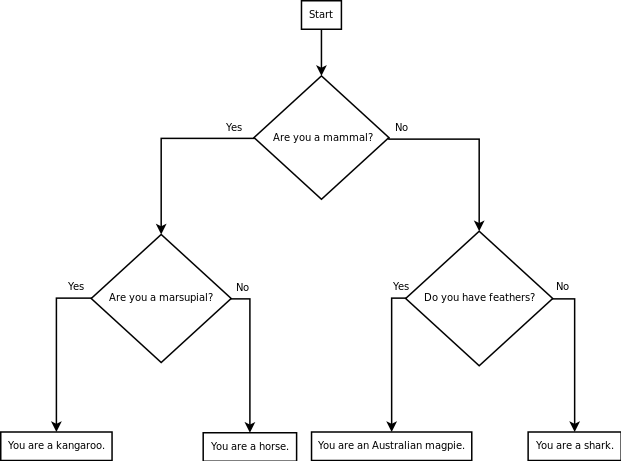

# Getting started

Get started by reading this lab description carefully, and then working in a small group to come up with a design to solve the problem described below.

**Do not start writing code** until your group is done with the design.

# Your task

Consider the following animal classification flowchart:

> 

Yeah.
