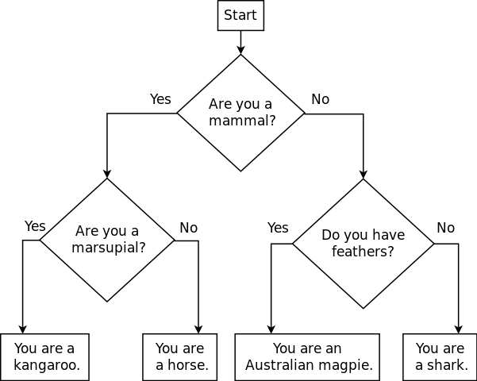

# Getting started

Get started by reading this lab description carefully, and then working in a small group to come up with a design to solve the problem described below.  Use the design artifact you brought to class as a starting point.

**Do not start writing code** until your group is done with the design.

# Your task

Consider the following animal classification flowchart:

> 

This flowchart describes how to ask the user some yes/no questions in order to determine what kind of animal she is.  (We'll admit that this may not be 100% accurate for all animals.)

## Designing for control flow

Yeah.
